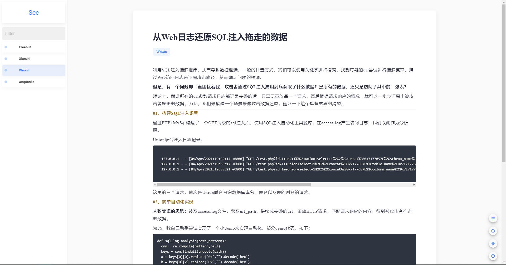

```ini
源码
├── back-stage
│   ├── base - 前台后端源码
│   │   └── app
│   │       └── config
│   │           └── config.ini - 配置文件
│   └── station - 后台后端源码
│   │   └── app
│   │       └── config
│   │           └── config.ini - 配置文件
│   └── requestments.txt - 后端环境依赖
└── front-stage
│   ├── base - 前台前端源码
│   └── station - 后台前端源码
│	Linux.md - 生产环境部署
└── Windows.md - 开发环境部署
```




